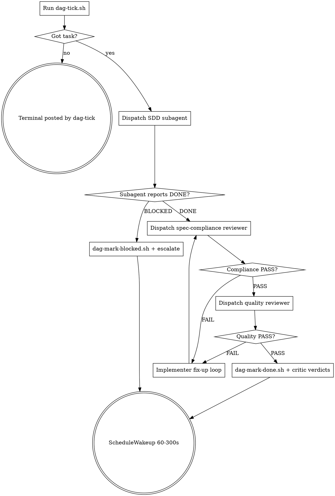

# Project DAG (autonomous run)

## Overview

Drives a multi-day autonomous run that drains implementation work from `docs/superpowers/dag/state.json`. Per Spec C v2 §3.3.

**Announce at start:** "I'm using the project-dag skill to advance one iteration of the autonomous DAG run."

## Per-iteration steps

## Concrete agent recipe

1. **Run `bash .claude/skills/project-dag/scripts/dag-tick.sh`**
   - If output starts with `TERMINAL:`, the run has terminated — post the summary to chat and stop. Do NOT call `ScheduleWakeup`.
   - Otherwise, parse the JSON task object (`{id, title, plan, ...}`).

2. **Construct subagent prompt** including:
   - Task ID + title
   - Plan file path (`docs/superpowers/plans/<plan>.md`) + Task header line (`checkbox_line`)
   - Hard scope: subagent only does the steps under that one Task header; cannot expand scope
   - Reminder: pre-commit critic gate runs on commit; subagent must pass it

3. **Dispatch via `Agent` tool with `subagent_type=general-purpose`** (or `Plan` if architecture work; should not happen for `implementer` tasks).

4. **On subagent return:**
   - If `BLOCKED` or implementer reports `NEEDS_CONTEXT` exhausted: `bash .claude/skills/project-dag/scripts/dag-mark-blocked.sh <task_id> "<reason>"`. Post escalation to chat. Continue to step 6.
   - If `DONE`: dispatch spec-compliance reviewer (subagent_type=general-purpose, instructions: "Review this commit against the plan task spec; report PASS or FAIL with reasoning"). On FAIL, dispatch implementer fix-up; loop until PASS or escalate after 2 retries.

5. **Quality review:** dispatch quality reviewer subagent. Same loop.

6. **Mark outcome:**
   - On full PASS: `bash .claude/skills/project-dag/scripts/dag-mark-done.sh <task_id> <commit_sha> '{"compliance":"PASS","quality":"PASS"}'`
   - On blocked: already done in step 4

7. **Schedule next wake:** call `ScheduleWakeup(delaySeconds=60, prompt="<original /loop prompt>", reason="next DAG iteration")`. The 60s delay keeps the prompt cache warm.

## Hard-stop triggers

Halt the loop (do NOT call `ScheduleWakeup`) on any of:

- **Critic FAIL** in `.claude/scripts/dispatch-critics.sh` output (any of the 6 critics)
- **3+ consecutive `task_blocked`** without intervening `task_done` (grep `run.jsonl`)
- **Allowlist edit detected** — subagent modified `engine/build.rs`; even if critic-allowlist-gate PASSED, escalate for user review
- **Schema-hash baseline change** — schema-bump critic flagged it
- **Test failure** the agent can't resolve in 2 retries

On hard-stop: post detailed escalation to chat including the failing critic / blocker / commit hash.

## What is NOT a hard-stop (handle inline, don't escalate)

Per (D) tiered autonomy, bookkeeping and reconciliation are **implementer territory**. The agent fixes these without asking:

- **Stale plan checkboxes.** Plan was already executed in git history but `- [ ]` was never flipped. Action: `sed -i 's/^- \[ \]/- [x]/g' <plan-file>` and re-bootstrap. Or, if many plans, force-mark via a single `jq` update on `state.json`. No escalation.
- **Missing prerequisite (e.g. dependent crate doesn't exist).** Don't dispatch a doomed implementer subagent. Defer the entire dependent plan: mark its tasks `deferred` in `state.json`. No escalation. The deferred plan will not block the dependents-of-its-tasks (per status enum semantics).
- **Cross-plan deps not declared.** If task X clearly depends on plan Y (per migration notes, prerequisites, or obvious file references) but no `Depends on:` line exists, add one to plan X's header and re-bootstrap. No escalation.
- **State drift.** `state.json` and plan-file checkboxes can drift due to manual edits. Re-bootstrap reconciles. No escalation.

**Rule of thumb:** if the fix is a `sed`, `jq`, or 3-line bash script and it produces a verifiable end-state (counts change as expected), it's bookkeeping — JUST DO IT.

Escalate only when **a real architectural choice or design tradeoff** surfaces that the agent shouldn't make alone.

## Daily synthesis

Every ~6-8 hours of wall-clock time, post a synthesis (template at `docs/superpowers/dag/templates/daily-synthesis.md`). Track via `run.jsonl` event count or wall-clock since last `daily_synthesis_posted` event.

## Pending decisions

When `dag-tick.sh` returns `TERMINAL: HUMAN_BLOCKED`:
- Read `docs/superpowers/dag/pending-decisions.md`
- Append fresh sections for newly-encountered `plan-writer` / `spec-needed` tasks (one per remaining pending non-implementer task)
- Post a chat summary listing what's queued + how user resolves each

## Reference

- Spec: `docs/superpowers/specs/2026-04-25-project-dag-v2-design.md`
- Bootstrap: `.claude/skills/project-dag/scripts/dag-bootstrap.sh`
- Status: `bash .claude/skills/project-dag/scripts/dag-status.sh`
